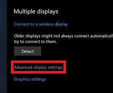
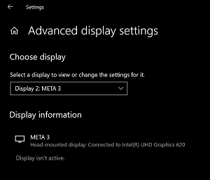

# Meta View Unity XR SDK Package

<!--
Copyright (c) 2020, Meta View, Inc.

All rights reserved.
SPDX-License-Identifier: UNLICENSED

Copyright (c) 2020, Valve Software

SPDX-License-Identifier: BSD-3-Clause
-->

This package provides direct-mode rendering for Meta View headsets on Windows 10
2004 and newer, through the Unity XR Plugin SDK.

For the purposes of this plugin, a "Meta View headset" is a display meeting both
of the following criteria:

- The PNPID used in the EDID is `CFR` or `MVA`.
- The CTA extension in the EDID contains the
  [Microsoft HMD vendor-specific data block (VSDB)][edid-ext], version 2, with
  primary product use case 0x7 ("Virtual reality headsets"). That is, the first
  two payload bytes of the block are 0x02, 0x07.

[edid-ext]: https://docs.microsoft.com/en-us/windows-hardware/drivers/display/specialized-monitors-edid-extension

It is based, in part, on the Valve SteamVR/OpenVR [unity-xr-plugin][], used
under the 3-clause BSD license, as well as the Microsoft
[DisplayCoreCustomCompositor][] sample available under the MIT license. It
bundles and depends on [DirectXTK for DX11][], August 2020 release, also
available under the MIT license. Additionally, it uses the Unity headers in the
`CommonHeaders/ProviderInterface` folder, where you'll find the Unity Companion
License
([/CommonHeaders/ProviderInterface/LICENSE.md](CommonHeaders/ProviderInterface/LICENSE.md)).
Where possible, SPDX license identifier metadata tags have been added, with
additional copyright/license data added as needed to the `.reuse/dep5` file per
the [reuse.software](https://reuse.software/) specification. (It does not comply
with that open-source focused specification entirely or pass `reuse lint`
because code written or modified expressly for this project is labeled as
"UNLICENSED", which is not a recognized open-source license identifier.)

[unity-xr-plugin]: https://github.com/ValveSoftware/unity-xr-plugin
[DisplayCoreCustomCompositor]: https://github.com/microsoft/Windows-classic-samples/tree/master/Samples/DisplayCoreCustomCompositor
[DirectXTK for DX11]: https://github.com/microsoft/DirectXTK

<!-- NOTE: The above text is replicated in com.metavision.unity/README.md - be sure to update both locations! -->

## Structure

**Important Note**: The Git repo for this plugin uses Git LFS, so you will need to run the
following before you clone, if you haven't yet on your user account:

```sh
git lfs install
```

If you cloned before doing this, running the following should fix your clone:

```sh
git lfs install
git lfs pull
```

If you get an error in Unity like the following:

```
Failed to load ..., expected x64 architecture, but was Unknown architecture. You must recompile your plugin for x64 architecture.
```

and the .DLL files just contain text, this is the cause, and `git lfs pull` will
fix it.

### Unity Package

There is a C# project in [./com.metavision.unity](./com.metavision.unity) which
is the Unity package that does the high level loading and configuration for the
plugin. We've included pre-built DLLs of the native code in this package for
ease of access.

### Native Plugin

The brains of the plugin are in a native dll at
[com.metavision.unity/Runtime/x64/XRSDKMetaView.dll](com.metavision.unity/Runtime/x64/XRSDKMetaView.dll).
The source for this dll is in the rest of this project, but mainly in the
[/Providers](Providers) directory. The code in the [/Model](Model) directory is
independent of Unity, and mostly concerned with the actual mechanics of
acquiring and rendering to a direct mode display.

**To build and update** the native plugin DLL, run the `.\build_all.ps1`
PowerShell script in a prompt, on a system with Visual Studio 2019 (or the
VS2019 build tools) and CMake (on the system path - try using
[scoop](https://scoop.sh)) available. This builds 32 and 64 bit native plugins
and places them in the Unity plugin folder. **Make sure** Unity is not open
while you do this, or it may fail to remove or replace the old files, or Unity
may delete the meta files while the replacement binaries are building.

If building manually, you will need to remove the old .dll and .pdb files from
the plugin directory, then build the "PlaceInPackage" target after building the
default targets.

### Sample Apps

There are a few non-Unity-based sample apps included with the source, and which
are built when building the native code.

- `GetTopology.exe` - Command-line tool that shows the display and adapter
  topology information available through the Windows.Devices.Display.Core API.
- `sample.exe` - Command-line tool that detects a direct-mode device and renders
  a sequence of fading colors to it for 10 seconds.
- `samplegui.exe` - GUI application that does the same as above, but continues
  doing it until the application is exited.
- `rendersample.exe` - Command-line tool that detects a direct-mode device and
  is meant to render a simple scene to it for 10 seconds. (This was a test to
  try to identify the source of the issue described below.) It renders flashing
  colors currently, **do not use**.

Note that the three apps that render will act like they are rendering, but not
actually display anything on the device, on AMD and Intel GPU systems. This is
not fully understood, but does not affect usage of the Unity plugin on these
systems. The samples work as intended on NVIDIA systems.

## Plugin Usage

There are a few ways of including the plugin from this directory.

In addition to using the plugin from this source, tagged releases have full
snapshots, as well as zipped copies of just the plugin (for newer releases)
here:
<https://gitlab.collabora.com/metaview/mev0002/unity-metaview-plugin/-/releases>
A zipped copy of the plugin is good particularly for the third installation
approach.

### Install via GUI - uses absolute path

In this method, the `Packages/manifest.json` file in your project will contain a
reference (absolute path!) to the location of this repo clone: it will not be
cached in your project unlike other packages.

* Open the Unity Package Manager (Window Menu -> Package Manager)
* Click the plus in the upper lefthand corner and select "Add package from disk..."
* Select the `package.json` in the `com.metavision.unity` directory

### Install via manifest - can use relative path

In this method, you directly edit the `Packages/manifest.json` file in your
project to add a relative path to the location of this repo clone: it will not
be cached in your project unlike other packages. The relative path makes this
more suitable for collaborative development.

* Make sure that this repo and the project are next to each other in a common
  parent directory. (If they are further apart for some reason, you will need to
  adjust the paths.)
* Open the `Packages/manifest.json` file in a text editor.
* Add the following entry in the `dependencies` object, typically near the top.
```json
    "com.metavision.unity": "file:../../unity-metaview-plugin/com.metavision.unity",
```
* While you are in this file, you can also remove unneeded dependencies easily,
  if desired.

### Install by bundling

You can copy the entire `com.metavision.unity` directory into your project's
`Packages` directory. It will not show up in the package manager but it should
still work. This was not tested during development, however.

### Activating - Common Steps For All Install Methods

* Open the XR Management UI (Edit Menu -> Project Settings -> XR Plug-in Management)
* Click the checkbox next to Meta View Loader
* Click over to the Meta View settings entry (under XR Plug-in Management): the
  main item to consider here is Stereo Rendering Mode.
  * The first two of these modes are stereo modes driven by the plugin: see
    `Providers/Display/Display.cpp` to adjust projection/FOV details.
    * "Multi Pass" is most compatible - it renders your main camera twice,
      independently, for each eye.
    * "[Single Pass Instanced][]" is much faster, but needs to be supported by
      your shaders - see the linked documentation.
  * "Single Camera" is an experimental mode: it's intended for use when you have
    a stereo camera rig explicitly in Unity already, and your final camera
    should just scanout to the screen.
    * This should work with your existing rendering rig - it worked with one I
      made from scratch to emulate your rig, though I hit some difficulties in
      use of your rig.
    * Note that newer versions of Unity, in addition to the changes in their own
      release notes, also permit use of newer versions of the URP (2019.3.15 is
      limited to 7.3.1) and the underlying packages, which have seen substantial
      development since the 7 series. It may be worth evaluating an update.
    * Once the rig is fixed so this displays something on the
      panels, it may need adjustment to set the right (orthographic) projection
      parameters in the C++ source.
* If an HMD with the correct direct-mode firmware/edid is not connected, the
  plugin will recognize this and error out, allowing you to use your previous
  extended mode rendering code.

[Single Pass Instanced]: https://docs.unity3d.com/Manual/SinglePassInstancing.html

## Known issues

Unless otherwise noted, these are with Unity 2019.3.15.

- Display panel blanks but does not turn off after usage.
  - Workaround: Unplug the HMD when done using it. This requires additional
    investigation and possible queries to Microsoft.
- Tracked Pose Driver (as used in a typical Unity XR rendering rig) does
  nothing, only returning identity poses.
  - This is intentional - because the description of the AntiLatency environment
    is entirely within Unity code, rather than in the service, it would be a
    larger task to port than if standard ALT markers were being used that could
    be configured externally.
- Launching the experience for the second or later time from the Unity editor
  may result in a backwards tracker behavior. Not fully diagnosed.
  - Workaround: Exit the Unity editor between runs.
- Builds with IL2CPP do not work due to AntiLatency Tracking, and the player log
  contains the following error: "NotSupportedException: IL2CPP does not support
  marshaling delegates that point to instance methods to native code. The method
  we're attempting to marshal is:
  `Antilatency.InterfaceContract.Details.IUnsafeRemap+<>c::<AppendVmt>b__14_0`"
  - Workaround: Use "Mono" builds (see "Project Settings -> Player -> Other ->
    Scripting Backend"). This is an issue with upstream ALT assets/SDK, not with
    this plugin, though it would go away after porting the tracking into the
    native plugin.
- Clicking a "Plugin Event" entry in the frame debugger showing a trace from
  "play mode" in 2019.3.15 will often hang the editor.
  - This appears to be an upstream Unity bug. It can be reproduced even with the
    Mock HMD plugin. I have not tried to reproduce it with a newer build of
    Unity.
- Use of a hybrid graphics machine where USB-C does not connect to the discrete
  graphics (e.g. Razer Blade late 2016 GTX1060) will only render on the attached
  GPU, not the discrete GPU.
  - Supporting discrete rendering on this topology would require additional
    investigation to handle texture copies between GPUs.
  - The "GetTopology.exe" sample app can show what Windows knows about
    topologies and exposes through the API used.
  - To see which GPU a device is connected to, go into "Display Settings", click
    "Advanced Display Settings" (near the bottom of the window), then choose
    your desired device from the drop-down.
    - 
    - 
- The additional native sample apps don't display on AMD or Intel GPUs, only NVIDIA.
  - This is an issue that needs further investigation, but it does not affect
    use of the Unity plugin.
